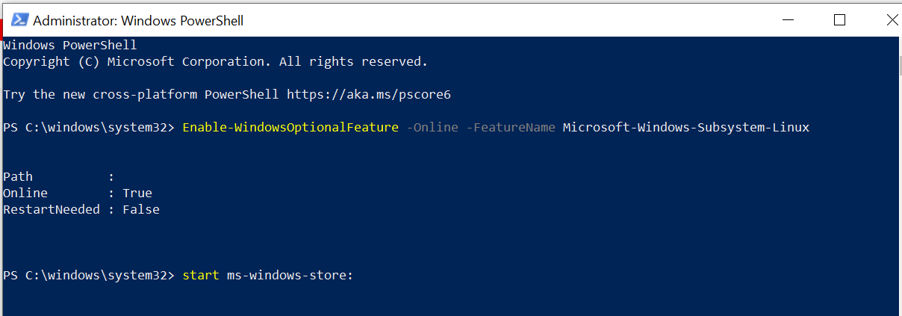
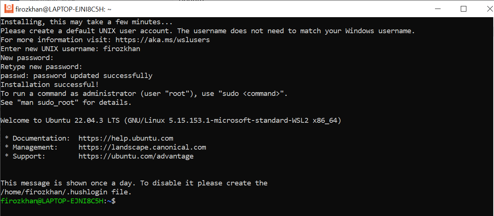
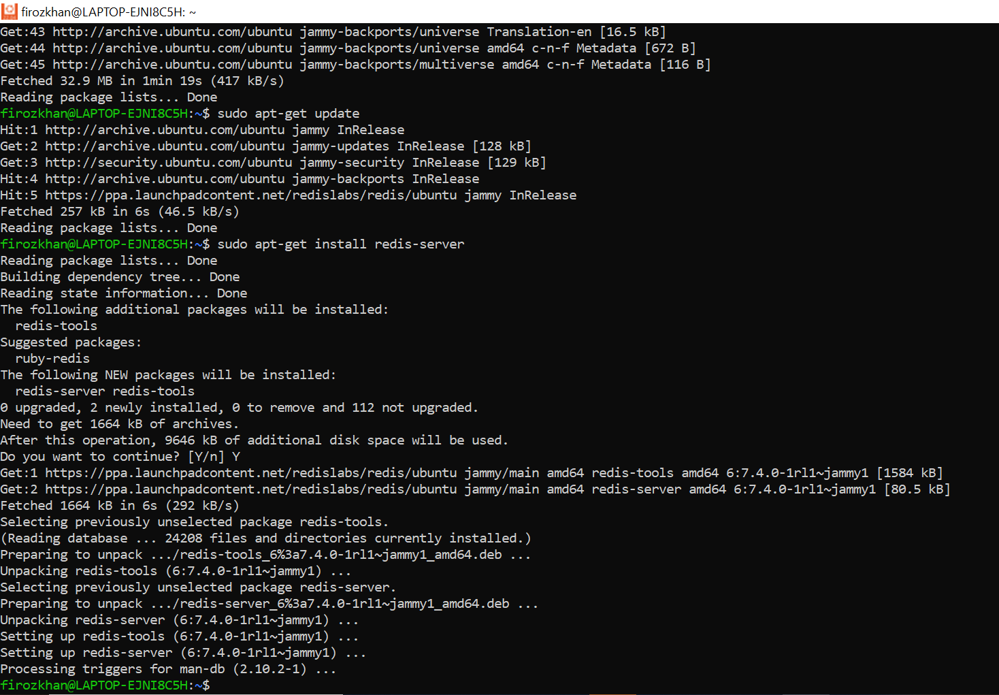
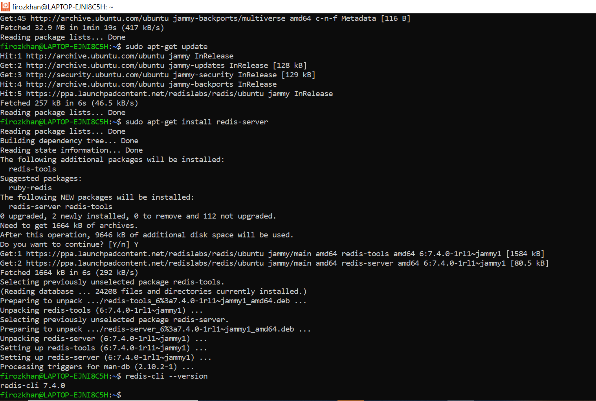
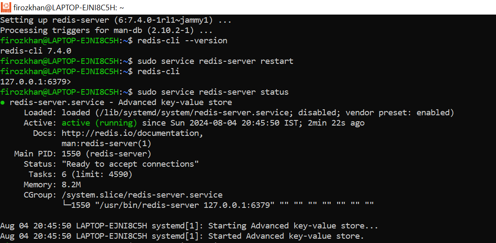
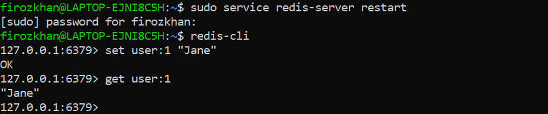

# Redis
---

### Table Of Contents

<details>
 <summary><b>Introduction to Redis</b></summary>

### Introduction to Redis

Redis, developed in 2009, is a flexible, open-source (BSD licensed), in-memory data structure store, used as database, cache, and message broker. Following in the footsteps of other NoSQL databases, such as Cassandra, CouchDB, and MongoDB, Redis allows the user to store vast amounts of data without the limits of a relational database.

It supports various data structures such as strings, hashes, sets, lists, sorted sets, bitmaps, hyperloglogs and geospatial indexes with radius queries.

Redis has built-in replication, Lua scripting, LRU eviction, transactions and different levels of on-disk persistence, and provides high availability via Redis Sentinel and automatic partitioning with Redis Cluster.

Redis can be compiled and used on Linux, OSX, OpenBSD, NetBSD, FreeBSD. It supports big endian and little endian architectures, and both 32 bit and 64 bit systems.

Redis is maintained and developed by Salvatore Sanfilippo. In the past, Pieter Noordhuis and Matt Stancliff provided a very significant amount of code and ideas to both the Redis core and client libraries.

What does the name Redis mean?

Redis stands for REmote DIctionary Server.

### What is Redis used for?

Redis is an advanced key-value store that can function as a NoSQL database or as a memory-cache store to improve performance when serving data that is stored in system memory.

### How to interact with Redis?

Once installed in a server, run the Redis CLI (Command Line Interface) to issue commands to Redis. While working on the CLI tool, your command-line prompt will change to: redis>

### Features:

**Speed** : Redis loads the whole dataset in memory. It loads up to 110,000 SETs/second and 81,000 GETs/second can be achieved in an entry level Linux box. Redis supports Pipelining of commands and getting and setting multiple values in a single command to speed up communication with the client libraries.

**Persistence** : While all the data lives in memory, changes are asynchronously saved on disk using flexible policies based on elapsed time and/or number of updates since last save. Redis supports an append-only file persistence mode. Check more on Persistence, or read the AppendOnlyFileHowto for more information.

**Data Structures** : It supports data structures such as strings, hashes, sets, lists, sorted sets with range queries, bitmaps, hyperloglogs and geospatial indexes with radius queries.

**Atomic Operations** : Redis operations working on the different Data Types are atomic, so setting or increasing a key, adding and removing elements from a set, increasing a counter will all be accomplished safely.

**Supported Languages** : Many languages have Redis bindings, including: ActionScript, C, C++, C#, Clojure, Common Lisp, D, Dart, Erlang, Go, Haskell, Haxe, Io, Java, JavaScript (Node.js), Julia, Lua, Objective-C, Perl, PHP, Pure Data, Python, R, Racket, Ruby, Rust, Scala, Smalltalk and Tcl.

**Master/Slave Replication** : Redis supports a very simple and fast Master/Slave replication. Is so simple it takes only one line in the configuration file to set it up, and 21 seconds for a Slave to complete the initial sync of 10 MM key set on an Amazon EC2 instance.
Sharding : Distributing the dataset across multiple Redis instances is easy in Redis, as in any other key-value store. And this depends basically on the Languages client libraries being able to do so.

**Portable** : Redis is written in ANSI C and works in most POSIX systems like Linux, BSD, Mac OS X, Solaris, and so on. Redis is reported to compile and work under WIN32 if compiled with Cygwin, but there is no official support for Windows currently.
Why is Redis is different compared to other key-value stores?

Redis is a different evolution path in the key-value DBs where values can contain more complex data types, with atomic operations defined on those data types. Redis data types are closely related to fundamental data structures and are exposed to the programmer as such, without additional abstraction layers.

Redis is an in-memory but persistent on disk database, so it represents a different trade off where very high write and read speed is achieved with the limitation of data sets that can't be larger than memory. Another advantage of in memory databases is that the memory representation of complex data structures is much simpler to manipulate compared to the same data structure on disk, so Redis can do a lot, with little internal complexity. At the same time the two on-disk storage formats (RDB and AOF) don't need to be suitable for random access, so they are compact and always generated in an append-only fashion.

### What happens if Redis runs out of memory?

Redis will either be killed by the Linux kernel OOM killer, crash with an error or will start to slow down. With modern operating systems malloc() returning NULL is not common, usually the server will start swapping, and Redis performance will degrade, so you'll probably notice there is something wrong.

The INFO command will report the amount of memory Redis is using so you can write scripts that monitor your Redis servers checking for critical conditions.

Redis has built-in protections allowing the user to set a max limit to memory usage, using the maxmemory option in the config file to put a limit to the memory Redis can use. If this limit is reached Redis will start to reply with an error to write commands, or you can configure it to evict keys when the max memory limit is reached in the case you are using Redis for caching.

You can easily build complex systems on top of Redis, here is a sample list :

- User defined indexing schemes
- Message queues with real time new element notification
- Directed and undirected graph stores for following or friending systems
- Real-time publish/subscribe notification systems
- Real-time analytics backends
- Bloom filter servers
- Task queues and job systems
- High score leaderboards
- User ranking systems
- Hierarchical/tree structured storage systems
- Individual personalized news or data feeds for your users'
  
### Features of the w3resource Redis tutorials

In this series of tutorials we have covered Redis 3.0.5 in detail. While creating this, we have take care that learners can master the basics of Redis.

Here is a list of features we have included in all of the chapters :

1. We have started from beginning i.e. from installation, with a clear and simple description.

2. We have clearly define Syntax / Usage so that you can remember how to write it.

3. Example(s) to show how the associated concept is implemented.

4. We have shown the Output of the usage.

5. Pictorial presentation to help you to understand the concept better.

6. You may refer Redis Manual along with this tutorial.
   
</details>
<details>
 <summary><b>Install Redis on Windows</b></summary>

Redis, a powerful open-source in-memory data store, is widely used for various applications. 

While Redis is often associated with Linux, you can also run it on Windows 10 using the Windows Subsystem for Linux (WSL2). 

This compatibility layer allows you to execute Linux commands natively on Windows, providing a seamless environment for running Redis.

Here's a step-by-step guide on how to set up and run Redis on Windows 10 using WSL2:

### Step 1: Enable Windows Subsystem for Linux (WSL2)

Open PowerShell as Administrator and run the following command to enable WSL2:

**`Enable-WindowsOptionalFeature -Online -FeatureName Microsoft-Windows-Subsystem-Linux`**

Reboot your system (this step is necessary only once).



### Step 2: Install Ubuntu from Microsoft Store

Launch the Microsoft Store. Search for "Ubuntu" or your preferred Linux distribution. Download and install the latest version of Ubuntu.

**`start ms-windows-store:`**

**Enter New User & Password**

https://developer.redis.com/create/windows



### Step 3: Install and Configure Redis





Launch the installed Ubuntu distribution. In the terminal, execute the following commands:
```
sudo apt-add-repository ppa:redislabs/redis
sudo apt-get update
sudo apt-get upgrade
sudo apt-get install redis-server
```
**Note**: The sudo command might be required based on your system's user configuration.

### Step 4: Restart Redis Server



After installation, restart the Redis server using:
```
sudo service redis-server restart
```
### Step 5: Verify Redis Installation

Test the Redis connectivity using the redis-cli command:
```
redis-cli
```
Inside the Redis CLI, execute the following commands:
```
127.0.0.1:6379> set user:1 "Jane"
127.0.0.1:6379> get user:1
```
You should see "Jane" as the output.



### Step 6: Stopping the Redis Server

To stop the Redis server, use the following command:
```
sudo service redis-server stop
```
Running Redis on Windows 10 through WSL2 provides you with a Linux-like environment where you can harness the full power of Redis for your projects. 

Remember that while Redis databases by default have indexes from 0 to 15, you can adjust this configuration as needed in the redis.conf file.

By following these steps, you can easily set up and run a Redis database on your Windows 10 machine using the Windows Subsystem for Linux. 

This enables you to leverage Redis for various applications and projects seamlessly.
</details>
<details>
  <summary><b>Redis Configuration</b></summary>
  
### Redis CONFIG Command
The proper way to configure Redis is by providing a Redis configuration file, usually called redis.conf (available at root the directory of redis). Though Redis is able to start without a configuration file using a built-in default configuration, however, this setup is only recommended for testing and development purposes.

The redis.conf file contains a number of directives, here is the format :

> keyword argument1 argument2 ... argumentN
Here is an example of configuration directive:

> slaveof 127.0.0.1 6380
### Changing Redis configuration while the server is running :

It is possible to reconfigure Redis on the fly without stopping and restarting the service or querying the current configuration programmatically using the special commands CONFIG SET and CONFIG GET. Not all the configuration directives are supported in this way, but most are supported as expected.

Here is the basic syntax of redis CONFIG command is shown below:

> redis 127.0.0.1:6379> CONFIG GET CONFIG_SETTING_NAME
### Example:

> 127.0.0.1:6379> config get save 
1) "save" 
2) "900 1 300 10 60 10000"
Use * in place of CONFIG_SETTING_NAME to get all configuration settings.


### Example:

> 127.0.0.1:6379> CONFIG GET *
  1) "dbfilename"
  2) "dump.rdb"
  3) "requirepass"
  4) ""
  5) "masterauth"
  6) ""
  7) "unixsocket"
  8) ""
  9) "logfile"
 10) "/var/log/redis_6379.log"
 11) "pidfile"
 12) "/var/run/redis_6379.pid"
 13) "maxmemory"
 14) "0"
 15) "maxmemory-samples"
 16) "5"
 17) "timeout"
 18) "0"
 19) "tcp-keepalive"
 20) "0"
 21) "auto-aof-rewrite-percentage"
 22) "100"
 23) "auto-aof-rewrite-min-size"
 24) "67108864"
 25) "hash-max-ziplist-entries"
 26) "512"
 27) "hash-max-ziplist-value"
 28) "64"
 29) "list-max-ziplist-entries"
 30) "512"
 31) "list-max-ziplist-value"
 32) "64"
 33) "set-max-intset-entries"
 34) "512"
 35) "zset-max-ziplist-entries"
 36) "128"
 37) "zset-max-ziplist-value"
 38) "64"
 39) "hll-sparse-max-bytes"
 40) "3000"
 41) "lua-time-limit"
 42) "5000"
 43) "slowlog-log-slower-than"
 44) "10000"
 45) "latency-monitor-threshold"
 46) "0"
 47) "slowlog-max-len"
 48) "128"
 49) "port"
 50) "6379"
 51) "tcp-backlog"
 52) "511"
 53) "databases"
 54) "16"
 55) "repl-ping-slave-period"
 56) "10"
 57) "repl-timeout"
 58) "60"
 59) "repl-backlog-size"
 60) "1048576"
 61) "repl-backlog-ttl"
 62) "3600"
 63) "maxclients"
 64) "10000"
 65) "watchdog-period"
 66) "0"
 67) "slave-priority"
 68) "100"
 69) "min-slaves-to-write"
 70) "0"
 71) "min-slaves-max-lag"
 72) "10"
 73) "hz"
 74) "10"
 75) "cluster-node-timeout"
 76) "15000"
 77) "cluster-migration-barrier"
 78) "1"
 79) "cluster-slave-validity-factor"
 80) "10"
 81) "repl-diskless-sync-delay"
 82) "5"
 83) "cluster-require-full-coverage"
 84) "yes"
 85) "no-appendfsync-on-rewrite"
 86) "no"
 87) "slave-serve-stale-data"
 88) "yes"
 89) "slave-read-only"
 90) "yes"
 91) "stop-writes-on-bgsave-error"
 92) "yes"
 93) "daemonize"
 94) "yes"
 95) "rdbcompression"
 96) "yes"
 97) "rdbchecksum"
 98) "yes"
 99) "activerehashing"
100) "yes"
101) "repl-disable-tcp-nodelay"
102) "no"
103) "repl-diskless-sync"
104) "no"
105) "aof-rewrite-incremental-fsync"
106) "yes"
107) "aof-load-truncated"
108) "yes"
109) "appendonly"
110) "no"
111) "dir"
112) "/var/lib/redis/6379"
113) "maxmemory-policy"
114) "noeviction"
115) "appendfsync"
116) "everysec"
117) "save"
118) "900 1 300 10 60 10000"
119) "loglevel"
120) "notice"
121) "client-output-buffer-limit"
122) "normal 0 0 0 slave 268435456 67108864 60 pubsub 33554432 8388608 60"
123) "unixsocketperm"
124) "0"
125) "slaveof"
126) ""
127) "notify-keyspace-events"
128) ""
129) "bind"
130) ""
### Edit configuration

To update configuration, you can use CONFIG set command

Basic syntax of CONFIG SET command :

> CONFIG SET CONFIG_SETTING_NAME NEW_CONFIG_VALUE
### Example:

> 127.0.0.1:6379> CONFIG SET loglevel "notice"
OK
> 127.0.0.1:6379> CONFIG GET loglevel
1) "loglevel"
2) "notice"
</details>

<details>
 <summary><b>Redis Data Types</b></summary>

### Data Types
 Redis is not a plain  key-value store, actually, it is a data structures server, supporting a different kind of values. In traditional  key-value stores, you associated string keys to string values, in  Redis the value is not limited to a simple string, but can also hold more complex data structures. The following is the list of all the data structures supported by Redis:

Binary-safe strings.
Lists
Sets
Sorted sets
Hashes
Bit arrays (or simply bitmaps)
HyperLogLogs:
### Redis keys:

Redis keys are binary safe (meaning they have a known length not determined by any special terminating characters), so you can use any binary sequence as a key, from a string like "foo" to the content of a JPEG file. The empty string is also a valid key. Here are some rules about keys:

The maximum allowed key size is 512 MB.
Very long keys are not a good idea.
Very short keys are often not a good idea. While short keys will obviously consume a bit less memory, your job is to find the right balance.
Try to stick with a schema. For instance "object-type:id" is a good idea, as in "user:1000". Dots or dashes are often used for multi-word fields, as in "comment:1234:reply.to" or "comment:1234:reply-to".
### Redis Strings:

Strings are  Redis’ most basic data type. It is the only data type in  Memcached, so it is also very natural for newcomers to use it in Redis. Since Redis keys are strings, when we use the string type as a value too, we are mapping a string to another string. The string data type is useful for a number of use cases, like caching HTML fragments or pages. Here are some common commands associated with strings:

SET: sets a value to a key
GET: gets a value from a key
DEL: deletes a key and its value
INCR: atomically increments a key
INCRBY: increments a key by a designated values
EXPIRE: the length of time that a key should exist (denoted in seconds)
Strings can be used to store objects, arranged by key.

127.0.0.1:6379>  SET newkey "the redis string"
OK
127.0.0.1:6379> GET newkey
"the redis string"
### Redis Lists:

Lists in  Redis are a collection of ordered values. This is in contrast to Sets which are unordered. Redis lists are implemented via Linked Lists. This means that even if you have millions of elements inside a list, the operation of adding a new element in the head or in the tail of the list is performed in constant time. Here are some common commands associated with lists:

LPUSH: Add a value to the begriming of a list
RPUSH: Add a value to the end of a list
LPOP: Get and remove the first element in a list
RPOP: Get and remove the last element in a list
LREM: Remove elements from a list
LRANGE: Get a range of elements from a list
LTRIM: Modifies a list so leave only a specified range
### Example:

redis 127.0.0.1:6379> lpush w3resourcelist redis
(integer) 1
redis 127.0.0.1:6379> lpush w3resourcelist mongodb
(integer) 2
redis 127.0.0.1:6379> lpush w3resourcelist rabitmq
(integer) 3
redis 127.0.0.1:6379> lrange w3resourcelist 0 10

1) "rabitmq"
2) "mongodb"
3) "redis"
### Redis Sets:

 Redis Sets are unordered collections of strings. If you want to combine strings, you can do that with  REDIS sets. Here are some common commands associated with sets:

SADD: Add one or members to a set
SMEMBERS: Get all set members
SINTER: Find the intersection of multiple sets
SISMEMBER: check if a value is in a set
SRANDMEMBER: Get a random set member
Sets can be helpful in various situations. In sets each member of a set is unique, adding members to a set does not require a "check then add" operation. Instead the set will check whether the item is a duplicate whenever an SADD command is performed.

### Example:

redis 127.0.0.1:6379> sadd w3resourcelist redis
(integer) 1
redis 127.0.0.1:6379> sadd w3resourcelist mongodb
(integer) 1
redis 127.0.0.1:6379> sadd w3resourcelist rabitmq
(integer) 1
redis 127.0.0.1:6379> sadd w3resourcelist rabitmq
(integer) 0
redis 127.0.0.1:6379> smembers w3resourcelist

1) "rabitmq"
2) "mongodb"
3) "redis"
### Redis Sorted sets:


Sorted sets are a data type which is similar to a mix between a Set and a Hash. Like sets, sorted sets are composed of unique, non-repeating string elements, so in some sense, a sorted set is a set as well.

However, while elements inside sets are not ordered, every element in a sorted set is associated with a floating point value, called the score (this is why the type is also similar to a hash, since every element is mapped to a value). Here are some common commands associated with sorted sets :

ZADD: Adds members to a sorted set
ZRANGE: Displays the members of a sorted set arranged by index (with the default low to high)
ZREVRANGE: Displays the members of a sorted set arranged by index (from high to low)
ZREM: Removes members from a sorted set
### Example:

redis 127.0.0.1:6379> zadd w3resourcelist 0 redis
(integer) 1
redis 127.0.0.1:6379> zadd w3resourcelist 0 mongodb
(integer) 1
redis 127.0.0.1:6379> zadd w3resourcelist 0 rabitmq
(integer) 1
redis 127.0.0.1:6379> zadd w3resourcelist 0 rabitmq
(integer) 0
redis 127.0.0.1:6379> ZRANGEBYSCORE w3resourcelist 0 1000

1) "redis"
2) "mongodb"
3) "rabitmq"
### Redis Hashes:

Hashes in  Redis are useful to represent objects with many fields. They are set up to store a vast amount of fields in a small amount of space. Here are some common commands associated with hashes:

HMSET: Sets up multiple hash values
HSET: Sets the hash field with a string value
HGET: Retrieves the value of a hash field
HMGET: Retrieves all of the values for given hash fields
HGETALL: Retrieves all of the values for in a hash
### Example:

In the following example hash, data type is used to store user's object which contains basic information of a user.

redis 127.0.0.1:6379> HMSET user:1 username w3resource password 123456 points 200
OK
redis 127.0.0.1:6379> HGETALL user:1

1) "username"
2) "w3resource"
3) "password"
4) "123456"
5) "points"
6) "200"
### Redis Bit arrays (or simply bitmaps):

It is possible, using special commands, to handle String values like an array of bits: you can set and clear individual bits, count all the bits set to 1, find the first set or unset bit, and so forth.

HyperLogLogs:

This is a probabilistic data structure which is used in order to estimate the cardinality of a set.
</details>
